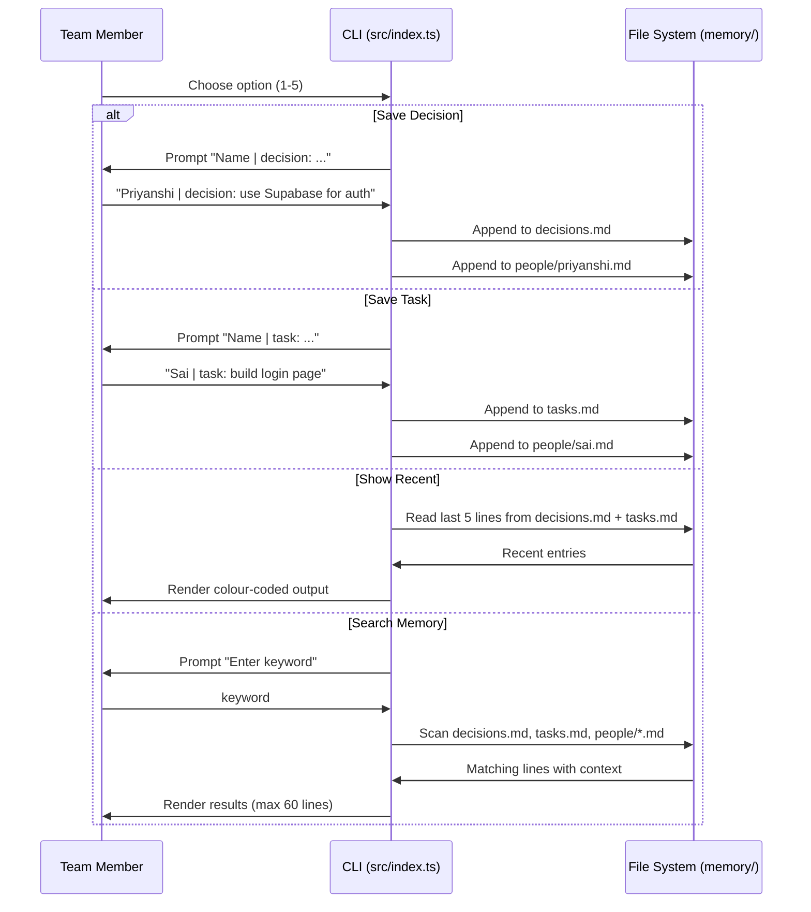

<div align="center">

# 🔗 Collab Mesh

### A shared team workspace — plan, decide, deliver.

*A Next.js marketing site paired with a Node.js CLI that gives every team a persistent, queryable memory for decisions, tasks, and people.*

[](https://nextjs.org/)
[](https://react.dev/)
[](https://www.typescriptlang.org/)
[](https://tailwindcss.com/)
[](#license)
[](CONTRIBUTING.md)
[](#roadmap)

</div>

---

## 📖 Overview

**Collab Mesh** is a two-part project built under the **Samsung PRISM** research program:

| Part | Description |
|---|---|
| **Web Frontend** | A clean Next.js 14 marketing and product site that showcases the Collab Mesh team-collaboration product |
| **CLI Memory Tool** | An interactive Node.js command-line tool that acts as a shared team memory — logging decisions, tasks, and per-person context into queryable Markdown files |

Together they demonstrate a full-stack prototype of a team coordination platform: a polished public face plus a functional backend utility that teams can run locally to maintain shared context.

---

## ✨ Features

### 🌐 Web Application

- **Modern landing page** — Hero section, features grid, workflow explainer, and contact CTA, all built with Next.js App Router
- **App Router pages** — `/`, `/about`, `/features`, `/demo`, `/contact`
- **Responsive layout** — Mobile-first design using Tailwind CSS utility classes
- **Sticky navigation** — Backdrop-blur navbar with smooth anchor-scroll links
- **Interactive task mockup** — UI preview card simulating a live sprint board

### 🖥️ CLI Memory Tool (`src/index.ts`)

- **Save decisions** — Timestamped entries appended to `memory/decisions.md`, attributed to a named team member
- **Save tasks** — Timestamped task entries appended to `memory/tasks.md`
- **Show recent memory** — Displays the last 5 entries from decisions and tasks
- **Per-person memory** — Each team member gets their own Markdown file in `memory/people/` aggregating their decisions and tasks
- **Keyword search** — Scans all memory files and returns matches with surrounding context lines
- **Coloured terminal UI** — Uses `chalk` for a readable, colour-coded interactive prompt

### 🔌 Adapters (extensibility layer)

- **Discord adapter stub** (`adapters/discord.ts`) — Placeholder for a future Discord bot integration that will relay memory operations to/from Discord channels

---

## 🏗️ Architecture

### System Overview

```mermaid
graph TD
    A[Browser / User] -->|HTTP| B[Next.js 14 App Router]
    B --> C[/ Home Page]
    B --> D[/about]
    B --> E[/features]
    B --> F[/demo]
    B --> G[/contact]

    H[Team Member CLI] -->|stdin/stdout| I[src/index.ts - Interactive CLI]
    I --> J[memory/decisions.md]
    I --> K[memory/tasks.md]
    I --> L[memory/people/*.md]

    M[adapters/discord.ts] -.->|future| I
```

### Data Flow — CLI Memory Tool



### Repository Structure

```
samsung_prism/
├── src/
│   ├── app/                    # Next.js App Router pages
│   │   ├── page.tsx            # Home / landing page
│   │   ├── layout.tsx          # Root HTML shell
│   │   ├── gloabals.css        # Tailwind base + CSS custom properties
│   │   ├── about/page.tsx      # About page (stub)
│   │   ├── contact/page.tsx    # Contact page (stub)
│   │   ├── demo/page.tsx       # Demo page (stub)
│   │   └── features/page.tsx   # Features page (stub)
│   ├── components/
│   │   ├── Navbar.tsx          # Site navigation (stub)
│   │   └── Footer.tsx          # Site footer (stub)
│   └── index.ts                # Interactive CLI memory tool
│
├── adapters/
│   └── discord.ts              # Discord integration stub
│
├── memory/                     # Flat-file team memory (git-tracked)
│   ├── decisions.md            # Append-only decision log
│   ├── tasks.md                # Append-only task log
│   └── people/
│       ├── priyanshi.md        # Per-person memory
│       └── sai prakash.md      # Per-person memory
│
├── public/
│   └── favicon.ico
│
├── next.config.js              # Next.js configuration (default)
├── tailwind.config.ts          # Tailwind theme + content paths
├── tsconfig.json               # TypeScript compiler settings
└── package.json                # npm scripts + dependencies
```

---

## 🛠️ Tech Stack

| Layer | Technology | Version | Purpose |
|---|---|---|---|
| **Framework** | [Next.js](https://nextjs.org/) | 14.2.3 | App Router, SSR, routing |
| **UI Library** | [React](https://react.dev/) | 18 | Component model |
| **Language** | [TypeScript](https://www.typescriptlang.org/) | 5 | Type-safe JS across frontend & CLI |
| **Styling** | [Tailwind CSS](https://tailwindcss.com/) | 3.4 | Utility-first CSS |
| **CSS Processing** | PostCSS + Autoprefixer | ^8 / ^10 | Cross-browser CSS transforms |
| **CLI Colouring** | [chalk](https://github.com/chalk/chalk) | (peer dep) | Terminal colour output |
| **Runtime** | Node.js | ≥18 | CLI tool + Next.js server |
| **Linting** | ESLint + eslint-config-next | ^8 / 14.2.3 | Code quality |

---

## 🚀 Getting Started

### Prerequisites

| Requirement | Minimum version |
|---|---|
| Node.js | 18.x |
| npm | 9.x |
| Git | any |

### 1. Clone the repository

```bash
git clone https://github.com/chouhanpriyanshi59-web/samsung_prism.git
cd samsung_prism
```

### 2. Install dependencies

```bash
npm install
```

### 3. Run the web application (development)

```bash
npm run dev
```

Open [http://localhost:3000](http://localhost:3000) in your browser.

### 4. Run the CLI memory tool

```bash
npx ts-node src/index.ts
# or, if ts-node is installed globally:
ts-node src/index.ts
```

You will see the interactive menu:

```
====================================
           COLLAB MESH
====================================
A shared team memory for decisions, tasks, and people

1) Save decision
2) Save task
3) Show recent memory
4) Open person memory
5) Search memory
0) Exit

Choose an option:
```

### 5. Build for production

```bash
npm run build
npm start
```

---

## 💻 Usage Guide

### Web Application

Navigate to the following routes after starting the dev server:

| Route | Description |
|---|---|
| `/` | Landing page — hero, features, workflow, contact |
| `/about` | About page (stub — in development) |
| `/features` | Features page (stub — in development) |
| `/demo` | Demo page (stub — in development) |
| `/contact` | Contact page (stub — in development) |

### CLI Memory Tool

#### Save a decision

```
Choose an option: 1
Type: Name | decision: ... : Priyanshi | decision: use Supabase for auth
→ Saved to memory/decisions.md and memory/people/priyanshi.md
```

#### Save a task

```
Choose an option: 2
Type: Name | task: ... : Sai Prakash | task: build login page
→ Saved to memory/tasks.md and memory/people/sai prakash.md
```

#### View recent memory

```
Choose an option: 3
→ Displays last 5 decisions and last 5 tasks
```

#### Open a person's memory

```
Choose an option: 4
Enter person name: priyanshi
→ Displays last 10 entries from memory/people/priyanshi.md
```

#### Search memory

```
Choose an option: 5
Enter keyword to search: auth
→ Returns matching lines with one line of context from all memory files
```

---

## 📁 Memory File Format

All memory is stored as append-only Markdown with ISO 8601 timestamps:

**`memory/decisions.md`**
```markdown
- [2026-05-05T18:01:43.900Z] use supabase for auth

- [2026-05-05T18:29:46.308Z] priyanshi: use supabase for auth
```

**`memory/people/priyanshi.md`**
```markdown
- [2026-05-06T17:09:28.334Z] task: add file

- [2026-05-06T17:10:41.123Z] decision: task done
```

This format is human-readable, diff-friendly, and can be version-controlled in git alongside the source code.

---

## 🧩 Extending with Adapters

The `adapters/` directory is designed to hold integrations with external messaging platforms. The Discord adapter stub is the starting point:

```
adapters/
└── discord.ts    ← implement your Discord bot here
```

Future adapters could relay CLI memory operations to/from team chat channels, enabling asynchronous collaboration across tools.

---

## 🛠️ Development Workflow

### Available Scripts

| Command | Description |
|---|---|
| `npm run dev` | Start Next.js in development mode with hot reload |
| `npm run build` | Compile production Next.js bundle to `.next/` |
| `npm start` | Serve the production build |
| `npm run lint` | Run ESLint across the project |

### Code Style

- **TypeScript strict mode** is enabled (`"strict": true` in `tsconfig.json`)
- **ESLint** uses `eslint-config-next` for Next.js-specific rules
- **Tailwind CSS** — utility classes only; custom tokens defined in `tailwind.config.ts`
- **Path aliases** — `@/*` maps to `./src/*` for clean imports

### Branch Strategy

```
main          ← stable / production-ready
feature/*     ← new features and pages
fix/*         ← bug fixes
```

---

## 📐 UI Showcase

> Screenshots will be added once the full UI build is complete.

| Page | Preview |
|---|---|
| Landing — Hero | `[ screenshot placeholder ]` |
| Landing — Features grid | `[ screenshot placeholder ]` |
| Landing — Workflow | `[ screenshot placeholder ]` |
| CLI — Main menu | `[ screenshot placeholder ]` |
| CLI — Search results | `[ screenshot placeholder ]` |

---

## 🗺️ Roadmap

Based on the current state of the codebase and the memory logs:

- [x] Next.js App Router project scaffolding
- [x] Landing page — hero, features, workflow, contact sections
- [x] Interactive CLI memory tool (decisions, tasks, people, search)
- [x] Markdown-based append-only memory storage
- [ ] Complete stub pages: `/about`, `/features`, `/demo`, `/contact`
- [ ] Implement `Navbar.tsx` and `Footer.tsx` components
- [ ] Discord adapter (`adapters/discord.ts`) — bot that reads/writes team memory
- [ ] Supabase authentication integration (logged in decisions.md)
- [ ] Login page / auth flow
- [ ] Additional messaging adapters (WhatsApp, Telegram)
- [ ] REST or tRPC API layer for memory read/write
- [ ] Deploy to Vercel (frontend) + persistent memory backend

---

## 🤝 Contributing

Contributions are welcome! Please follow these steps:

1. Fork the repository
2. Create a feature branch: `git checkout -b feature/your-feature-name`
3. Commit your changes: `git commit -m "feat: add your feature"`
4. Push the branch: `git push origin feature/your-feature-name`
5. Open a Pull Request against `main`

Please keep PRs focused and small. All code must pass `npm run lint` before review.

---

## 🔒 Security Considerations

- **No secrets in source** — no API keys, tokens, or credentials are committed to this repository
- **Markdown memory files** are stored locally and version-controlled; ensure `.gitignore` is updated before adding any sensitive data to memory logs
- **Dependency hygiene** — keep `npm audit` clean; run `npm audit fix` regularly
- **TypeScript strict mode** catches common type errors at compile time, reducing runtime vulnerabilities

---

## ⚠️ Build & Dependency Note

This repository intentionally does not include generated build output or installed packages.

- `node_modules/` — install with `npm install`
- `.next/` — generated by `npm run build`

```bash
# After cloning — all you need:
npm install
npm run dev     # development
npm run build   # production bundle
```

---

## 📄 License

This project is private and developed as part of the **Samsung PRISM** research program. All rights reserved.

---

## 👥 Authors & Maintainers

| Name | Role |
|---|---|
| **Priyanshi Chouhan** | Project lead, frontend & CLI development |
| **Sai Prakash** | Contributor |

---

## 🙏 Acknowledgements

- [Samsung PRISM](https://www.samsungprism.com/) — for providing the research platform and project framework
- [Next.js](https://nextjs.org/) — for the App Router and developer experience
- [Tailwind CSS](https://tailwindcss.com/) — for the utility-first styling system
- [chalk](https://github.com/chalk/chalk) — for making the CLI a pleasure to use
